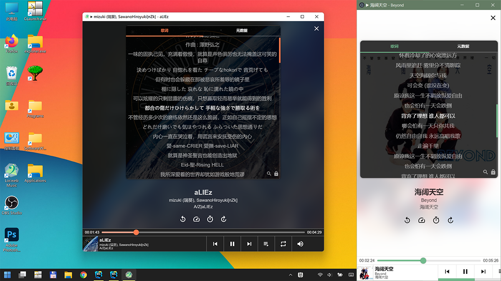

# 本地云音乐 - Locweb Music

用来播放本地音乐文件的`通用`应用程序

A web application for playing local music files

# 截图 · Screenshot



# 技术栈 · Technologies

- 后端: Node.js
- 前端: Vue 2
- 支持 Electron 客户端

# 构建步骤 · Build Steps

```sh
# 安装依赖
yarn install

# 自动化构建服务端（Node.js）、前端（Vue）、客户端（Electron）
# 生成可运行的二进制文件
yarn build-electron
```
